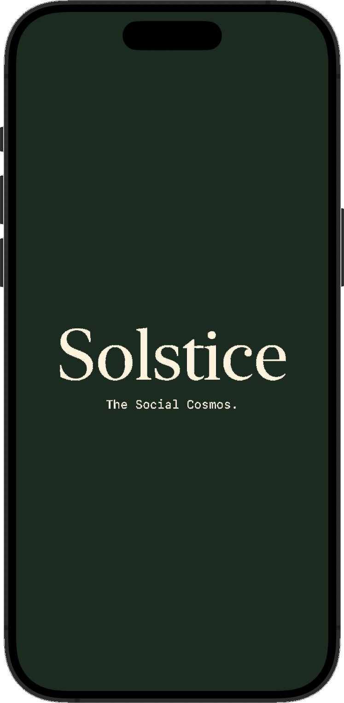

# Solstice Social - Backend

Solstice is an 18+ Apple Exclusive application that ties social, dating, gaming, friend-making, and a life-simulator all into one.

It's currently being built out, however, the personality and astrology comparison backend are mostly complete.

It will be one of the many endpoints that the SwiftUI application for iOS, macOS, iPadOS, visionOS, and tvOS will all collectively use for Astrology and Personality based features.

  
  

## Table of Contents
1. [Introduction](#introduction)
2. [Plans & Roadmap](#plans--roadmap)
    - [Recommendation Engine](#recommendation-engine)
    - [Gaming](#gaming)
3. [Mission, Values, and Reasoning](#mission-values-and-reasoning)
4. [Exclusive 18+ Apple Network](#exclusive-18-apple-network)
5. [Meme Creation and Detection](#meme-creation-and-detection)
6. [Psychoanalysis Features](#psychoanalysis-features)
7. [License](#license)

## Introduction

This repository contains the backend service for astrology and personality features in Solstice, an 18+ Apple Exclusive social application. The primary purpose of this service is to calculate astrological and personality trait compatibility between users and provide related features.

## Plans & Roadmap

### Recommendation Engine

The main purpose of this codebase is to calculate compatibility between two people's entire astrological charts, as well as their 46 different personality traits. Think of it like Co-Star, Myers-Briggs, and Hinge merged into one. This service will be a component of the broader recommendation engine for suggesting posts, profiles, and potential matches. Other components will include psychological analysis scores and native multi-modal AI embeddings (video, text, images, etc.), all contributing to a generative adversarial network (GAN) for comprehensive recommendations.

### Gaming

With the advent of Apple's Vision Pro, I believe virtual reality will become more mainstream. The plan is to create a social media network with VRChat-like capabilities, starting with Unity for good graphics and eventually moving to Unreal Engine 5. Features will include:

- **In-game houses:** Users can customize and buy houses with points serving as both in-game and real-world currency.
- **Beer Pong Game:** Utilizing CoreML with built-in LiDAR and camera to track hand movements, speed, and direction for hyper-realistic gameplay.
- **Apple Services Integration:** Apple Music & Shareplay, and CoreML for immersive experiences.
- **Persistent MMORPG Elements:** The game continues with or without the user.
- **Minigames:** Pirate-style Capture the Flag, Solstice rendition of Mario Kart, and more.
- **Stats & Leaderboards:** Real-time tracking of most popular posts of the day to encourage the generation of quality content. Each day's leaderboard will be finalized at 9PM Central Time. Profiles will have a Stats card that shows things like how many times they've made it to the top 100 daily leaderboard.

## Mission, Values, and Reasoning

Solstice aims to create an inclusive and engaging social platform that combines the best aspects of social networking, gaming, and astrology. Our mission is to foster meaningful connections and provide a unique, immersive experience for our users.

## Exclusive 18+ Apple Network

Solstice is designed as an 18+ exclusive network for several reasons:

- **Ethical Considerations:** Social networks expose kids to adult content, bullying, and predators. We aim to provide a safer environment for kids by pushing adults to strictly use an adults-only platform.
- **Integration with Apple Services:** Focusing on Apple-exclusive devices allows seamless integration with Apple Music, Apple TV, and more, allowing users to collectively DJ the music during in-game house parties.
- **Targeted Development:** Building for a finite number of devices with consistent OS, platform, and architecture simplifies development.

## Meme Creation and Detection

Inspired by Dingboard, Solstice will have a major focus on meme creation and detection:

- **Meme Studio:** A simple, fast, and affordable image editing solution directly integrated into the platform.
- **AI Segmentation and In-painting:** Utilizing AI to enable advanced features while remaining lightweight and accessible.
- **Community Engagement:** Enabling users to participate in meme culture and visual communication.
- **Meme Collection:** Keep all your memes in one place and will suggest reaction memes from your collection to reply with based on the post's content, while also integrating a keyboard extension that allows for quick access to them for iMessage.

## Psychoanalysis Features

Solstice will include psychoanalysis features inspired by Duolicious. Users will answer a series of questions that build a detailed psychoanalysis profile. This profile will be used to calculate compatibility with potential matches. The traits and questions will cover a wide range of personality aspects, such as:

- **Introversion/Extraversion**
- **Thinking/Feeling**
- **Sensing/Intuition**
- **Judging/Perceiving**
- **Conscientiousness**
- **Agreeableness**
- **Neuroticism**
- **Individualism/Collectivism**
- **Libertarianism/Authoritarianism**
- **Environmentalism/Anthropocentrism**
- **Security/Freedom**
- **Non-interventionism/Interventionism**
- **Equity/Meritocracy**
- **Empathy**
- **Honesty**
- **Humility**
- **Independence**
- **Patience**
- **Persistence**
- **Playfulness**
- **Rationality**
- **Religiosity**
- **Self-acceptance**
- **Sex Focus**
- **Thriftiness**
- **Thrill-seeking**
- **Emotional Openness in Relationships**
- **Equanimity**
- **Family Focus**
- **Loyalty**
- **Preference for Monogamy**
- **Trust**
- **Self-esteem**
- **Anxious Attachment**
- **Avoidant Attachment**
- **Career Focus**
- **Emphasis on Boundaries**
- **Fitness Focus**
- **Stability of Self-image**
- **Love Focus**
- **Maturity**
- **Wholesomeness**
- **Traditionalism about Love**
- **Openness to Experience**

These features will add depth to user profiles, making matchmaking more accurate and engaging.

## Astrology
- **Chart Creation:** Generation of birth and natal charts.
- **Compatibility & Explanation:** Calculation of complete compatibility between two users charts with in-depth descriptions for each sign for every celestial body explaining why they receied that score.
- **Twin Flame & Soulmate:** If the planets align, there should be a "Twin Flame" or "Soulmate" badge appearing on that user's profile.

## License

This backend currently uses the GNU Affero General Public License, as required by the Swiss Ephemeris and Duolicious.